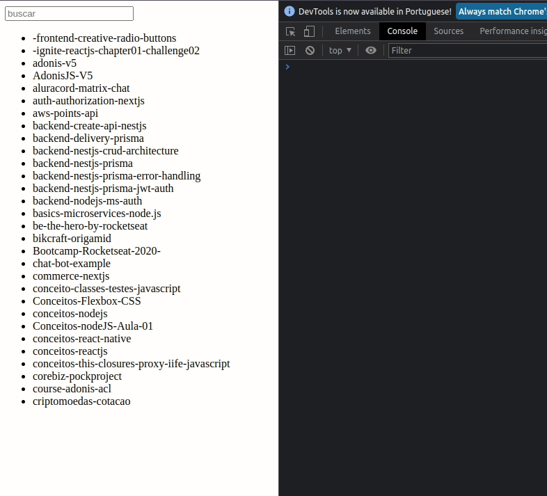
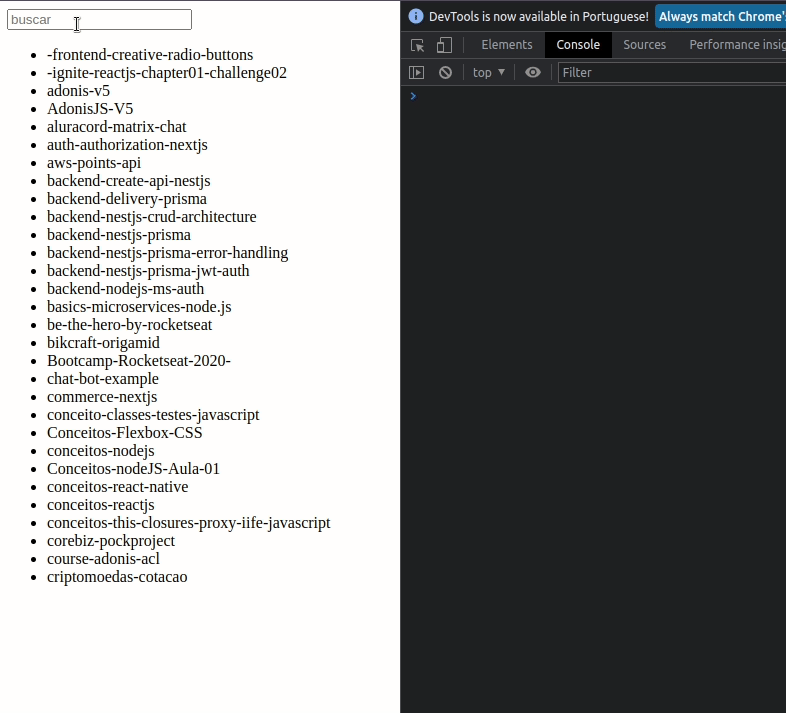

<div align="center" id="top"> 
  <h1>- Código não otimizado</h1>

  

  <h1>- Código otimizado</h1>

  

&#xa0;

</div>

<h1 align="center">Error Derived State</h1>

<p align="center">
  

  

  

  
 
</p>

<p align="center">
  <a href="#dart-about">About</a> &#xa0; | &#xa0;  
  <a href="#rocket-technologies">Technologies</a> &#xa0; | &#xa0;
  <a href="#white_check_mark-requirements">Requirements</a> &#xa0; | &#xa0;
  <a href="#checkered_flag-starting">Starting</a> &#xa0; | &#xa0;
  <a href="#memo-license">License</a> &#xa0; | &#xa0;
  <a href="https://github.com/wsasouza" target="_blank">Author</a>
</p>

<br>

## :dart: About

Um dos erros mais comuns no React (e você provavelmente já cometeu também) é a criação de estados derivados, que são estados criados a partir de outra informação já presente no componente.

Esses estados acabam causando renderizações desnecessárias, que podem ser substituídos facilmente por variáveis calculadas em tempo de execução.

## :rocket: Technologies

The following tools were used in this project:

- [React](https://pt-br.reactjs.org/)
- [TypeScript](https://www.typescriptlang.org/)

## :white_check_mark: Requirements

Before starting :checkered_flag:, you need to have [Git](https://git-scm.com) and [Node](https://nodejs.org/en/) installed.

## :checkered_flag: Starting

```bash
# Clone this project
$ git clone https://github.com/wsasouza/error-derived-state

# Access
$ cd error-derived-state

# Install dependencies
$ yarn

# Run the project
$ yarn start

# The server will initialize in the <http://localhost:3000>
```

## :memo: License

This project is under license from MIT. For more details, see the [LICENSE](LICENSE.md) file.

Made with :heart: by <a href="https://github.com/wsasouza" target="_blank">Walter Santos de Andrade Souza</a>

&#xa0;

<a href="#top">Back to top</a>
